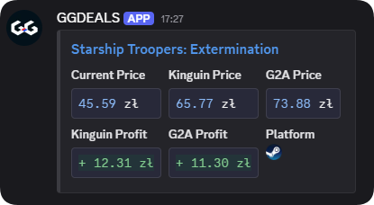
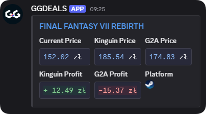

# 🎮 GG-Deals Scraper Bot

A robust Discord notification bot that periodically scrapes [GG-Deals](https://gg.deals) for the latest game offers, evaluates potential profits from reselling on platforms like Kinguin and G2A, and sends detailed notifications directly to your Discord webhook.

## 📸 Example Notifications




---

## 🚀 Features

- **Periodic Web Scraping**: Automatically fetches new offers from GG-Deals.
- **Real-Time Price Analysis**: Compares current lowest prices with Kinguin and G2A, calculating potential profits after fees.
- **Dynamic Currency Conversion**: Uses real-time EUR/USD/PLN exchange rates for accurate profit calculations.
- **Discord Integration**: Sends clean, visually appealing notifications to Discord with profit analysis, using a color-coded embed (`diff` trick) for quick profit/loss visibility.
- **Customizable Notifications**: Set profit thresholds and notification sounds directly from the configuration file.
- **Data Persistence**: Stores historical listings in a local database to prevent duplicate processing and enable future analysis.

---

## ⚙️ Installation

### Clone Repository
```bash
git clone YOUR_REPOSITORY_URL
cd gg-deals-scraper
```

### Install Dependencies
Ensure Python 3.9+ is installed, then run:
```bash
pip install -r requirements.txt
```

### Requirements
```
aiohttp==3.9.3
beautifulsoup4==4.13.3
pygame==2.6.0
python-dotenv==1.1.0
requests==2.32.3
selenium==4.30.0
webdriver_manager==4.0.2
```

---

## 🔧 Configuration

Create a `.env` file based on the provided `.env.example`:

```env
# Database file location
DB_FILE=your_database_file.db

# Chromedriver executable path
CHROMEDRIVER_PATH=path/to/chromedriver.exe

# List allowed DRM platforms separated by commas (e.g., Steam,Origin)
ALLOWED_DRMS=Steam,Origin

# Your Discord webhook URL
DISCORD_WEBHOOK_URL=https://discord.com/api/webhooks/YOUR_WEBHOOK

# Duration for cached exchange rates in hours (recommended: 24)
CACHE_DURATION_HOURS=24

# Cache file for exchange rates
CACHE_FILE=exchange_rates.json

# Base URL for GG-Deals
BASE_URL=https://gg.deals

# Notification sound file path
NOTIFICATION_SOUND=resources/notification_sound.mp3

# API endpoints for currency exchange rates (do not change unless necessary)
EUR_TO_USD_URL=https://api.exchangerate-api.com/v4/latest/EUR
USD_TO_PLN_URL=https://api.exchangerate-api.com/v4/latest/USD
```

Replace placeholders (such as `your_database_file.db`, webhook URLs, and paths) with your actual values.

---

## ▶️ Usage

To run the bot, simply execute:
```bash
python scanner.py
```

### 🔔 Notification Customization
- Adjust the notification thresholds directly within the configuration to filter notifications based on profitability.
- Notifications will appear green (profitable) or red (unprofitable) for quick evaluation.
- Sound alerts can be configured to trigger only when specific profitability thresholds are met.

---

## 📚 Database
The bot maintains an SQLite database for:
- Tracking processed listings to avoid duplication.
- Facilitating future data analysis and insights.

---

## 🙌 Acknowledgements
- [GG-Deals](https://gg.deals) for providing price data.
- ExchangeRate-API for currency conversion data.

